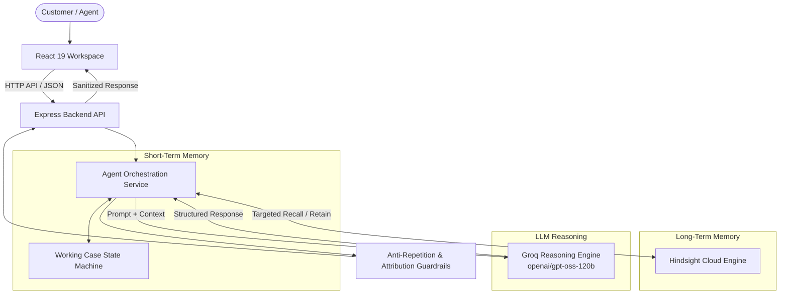

# MemoryDesk System Architecture

MemoryDesk is an AI-native customer support platform designed around the principle of **"Support that remembers."** It combines short-term conversational context tracking with persistent, cross-session long-term memory.

---

## High-Level Architecture

---

## Detailed Component Flow

1. **Frontend Interaction**:
   - The customer or agent sends a message from the 3-column workspace.
   - The client invokes `POST /api/support/message` with `{ customerId, message }`.

2. **Backend API**:
   - Validates input parameters and sanitizes incoming payload.
   - Routes request to `runSupportAgent(customerId, message)`.

3. **Working Case State (Short-Term Memory)**:
   - Maintains real-time tracking within the current problem lifecycle:
     - Recognized environment (`device`, `operatingSystem`, `applicationVersion`)
     - Symptoms identified
     - Known facts vs. missing critical information
     - Questions previously asked (prevents repetitive inquiries)
     - `actionHistory` (chronological record of every troubleshooting step attempted)

4. **Hindsight Cloud Recall (Long-Term Memory)**:
   - Performs targeted semantic query against `customer-{id}` memory bank.
   - Recalls prior resolutions, failed attempts, and historical environmental changes.

5. **Groq LLM Reasoning**:
   - Reasoner (`openai/gpt-oss-120b` on Groq) analyzes current symptoms, past memories, and working case facts.
   - Employs domain-agnostic decision-making: determines whether to clarify, diagnose, suggest steps, or follow up.

6. **Anti-Repetition & Outcome Attribution Guardrail**:
   - Programmatically verifies that proposed actions have not already failed.
   - Attributions: Explicit `success`, explicit `failure`, or `in_progress`. Never fabricates outcomes.

7. **Hindsight Retention**:
   - Automatically writes structured interaction observations back to Hindsight Cloud for future recall.

8. **Response Delivery**:
   - Sanitized response, recalled memory references, and updated case state returned to the frontend.
